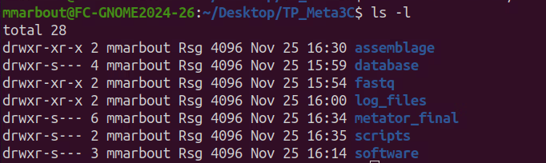

# Session 1

## mise en place de l'environnment et de l'arborescence

se placer sur le bureau de la Machine virtuelle

```sh
cd ~/Bureau/
```

créer un répertoire (l'option -p permet de créer des répertoires de manière recursive et dans des répertoires n'existant pas et évite les messages d'erreurs ... c'est parfois utile et c'est un réflexe chez moi)

```sh
mkdir -p TP_Meta3C/
```
rentrer dans le repertoire

```sh
cd  TP_Meta3C/
```

toutes les lignes de commande que vous verrez s'exécuteront depuis cet emplacement désormais !!!!


créer un répertoire pour y déposer les fichiers fastq et les fichiers log des différents logiciles

```sh
mkdir -p fastq/
mkdir -p log_files/
```

Vous allez travailler avec 4 fichiers de sorties de séquençage : les reads en sens (forward) et en anti-sens (reverse) pour chaque banque construites (ShotGun et 3C). Vos fichiers sont nommés ainsi et se trouve sur l'espace GAIA:

* libX_SG_for.fastq.gz
* libX_SG_rev.fastq.gz
* libX_3C_for.fastq.gz
* libX_3C_rev.fastq.gz


choisissez au hasard parmi les 10 jeux de données et copier les fichiers fastq correspondants (n'oubliez pas de changer le X !!!)

```sh
scp votrelogin@sftpcampus.pasteur.fr:/pasteur/gaia/projets/p01/Enseignements/GAIA_ENSEIGNEMENTS/AdG_2024-2025/TP_Meta3C/fastq/libX_* fastq/
```

pour les différentes séances nous aurons également besoin de différentes données et fichiers.


Copier les dossiers suivants sur GAIA --> [database/] [software/] [metator_final/] [scripts/] [assemblage/] 

je vous donne un exemple ci-dessous pour un de ces répertoires et je vous laisse faire pour les suivants ;)

```sh
scp -r votrelogin@sftpcampus.pasteur.fr:/pasteur/gaia/projets/p01/Enseignements/GAIA_ENSEIGNEMENTS/AdG_2024-2025/TP_Meta3C/database/ ./
```

C'est bon ? 

normalement si vous faites la commande suivante, vous devriez voir 7 répertoires.

```sh
ls -l
```



il reste une dernière chose à faire et pas des moindres ... installer le pipeline metator!!!

mais avant il va falloir installer quelques programmes. Pour cela nous allons utilisons Conda qui est un système de gestion de paquets et d'environnement open-source qui fonctionne sous Windows, macOS et Linux. Conda installe, exécute et met à jour rapidement les paquets et leurs dépendances. Conda crée, enregistre, charge et bascule facilement entre les environnements sur votre ordinateur local.

Pour gérer conda nous utiliserons micromamba qui est extremement rapide:

```sh
"${SHELL}" <(curl -L micro.mamba.pm/install.sh)
```

une fois installé , nous pouvons vérifier que tout se passe bien en faisant un update de micromaba

```sh
micromamba self-update
```
il est alors possible de créer un environnement dédié à notre logiciel MetaTOR.

```sh
create -n metator bioconda::metator
```

il faut ensuite activer l'envrionnement, cloner le repo github et reinstaller metator à partir de cet emplacement

```sh
micromamba activate metator
git clone https://github.com/koszullab/metator
cd metator
pip3 install -e .[dev]
```


pour désactiver l'environnement, il suffit de taper la commande suivant 

```sh
micromamba deactivate
```

gardez bien en tête qu'il faudra activer l'environnement à chaque fois que l'on veut utiliser MetaTOR.


si tout est ok, alors on est prêt à commencer !!!


## Analyse de l'assemblage

Une des opérations fondamentales en (méta)génomique est l’assemblage. Celui-ci a pour objectif de retrouver le génome original qui a été morcelé pendant la phase de séquençage. Un jeu de données génomiques est alors vu comme un énorme puzzle où les pièces sont les lectures. Deux lectures peuvent s’assembler si elles se chevauchent d’un certain nombre de nucléotides. Les lectures ainsi fusionnées forment des séquences de plus en plus longues que l’on appelle "contigs". D’un point de vue informatique, ce puzzle est généralement représenté par un graphe où les nœuds sont des séquences et où les arêtes représentent le chevauchement entre deux séquences. Les contigs sont ensuite formés en parcourant les chemins de ce graphe. En pratique, cette tâche est très complexe. Inévitablement, il existe des régions du graphe où les séquences successives se chevauchent avec plusieurs autres, forment des cycles, etc. La difficulté principale provient des grandes régions répétées du génome. Cela implique qu’une lecture peut apparaitre à plusieurs endroits du génome et possède donc plusieurs contextes. Plus le génome original contient de longues répétitions, plus il est complexe à assembler. Plus il est long, plus le nombre de lectures nécessaire est grand et plus il faut de ressources informatiques et de temps pour l’assembler. Il est donc plus simple d’assembler les lectures d’une bactérie, dont le génome est généralement court et avec peu de longues répétitions, que celles d’un humain. Il existe un large éventail d’outils d’assemblage. Ceux-ci diffèrent majoritairement par leur manière de représenter le graphe et de construire des contigs. Chaque méthode offre un compromis entre temps de calcul, quantité de mémoire requise et qualité des résultats. 

Dans le cas de la métagénomique, la différence majeure est que les échantillons sont des "soupes" composées de nombreux individus appartenant à différentes espèces pour la plupart inconnues des bases de données biologiques. Il n’est donc pas possible de savoir a priori quelles espèces ont été́ séquencées. Ainsi, en génomique, si l’assemblage est vu comme la résolution d’un puzzle contenant des millions de pièces, l’assemblage d’un jeu de données métagénomiques peut alors être vu comme la résolution d’une multitude de puzzles mélangés. Le passage à la métagénomique soulève donc de nouveaux problèmes tels que l’identification des espèces présentes, leurs quantités, leurs fonctions dans l’environnement, et requiert le développement de méthodes spécifiques.

Le but de cette partie est d’obtenir un assemblage de notre métagénome, un jeu de contigs à partir de petites lectures d’ADN. Un contig est une séquence génomique continue et ordonnée générée par l'assemblage de lectures d'ADN (lectures = reads). Les assembleurs actuels sont majoritairement basés sur des graphes de Bruijn qui modélisent la relation entre des sous-chaines exactes, extraites des fragments de séquençage. Ces assembleurs reposent sur l'identification de chevauchements exacts et sont donc particulièrement sensibles à la présence d'erreurs de séquençage.

Pour l’assemblage nous avons utilisé le programme megahit (il en existe beaucoup d'autres, chacun avec ses spécificités). Le logiciel megahit constitue un bon compromis entre vitesse, consommation de mémoire et performances d'assemblage. Megahit est conçu pour effectuer un assemblage métagénomique itératif rapide. L'utilisateur peut fournir différents paramètres d'assemblage et la taille des kmer itératifs. Dans notre cas, nous utiliserons les paramètres par défaut du logiciel.
Pourquoi un assemblage itératif ? Comme indiqué dans Megahit : Alors qu'une petite taille de k-mer est favorable pour filtrer les "liens" (edge of the de brujin graph) erronés et combler les trous dans les régions à faible couverture, une grande taille de k-mer est utile pour résoudre les problèmes d'assemblages dû aux répétitions.


Nous avons généré un assemblage issue d'un grand nombre de reads shotgun de notre communauté. Cet assemblage a été réalisé sur le cluster de calcul de l'Institut Pasteur car le nombre de reads est assez important et, par conséquent, les temps de calcul et les besoins en ressources également. Vous trouverez deux fichiers dans le repertoire [assemblage/]: 

* le fichier de sortie brut de Megahit: final.contigs.fa
* le fichier avec des entrées de contigs renomées: assembly_all.fa

explorer le répertoire de sortie de l'assemblage

```sh
ls -l assemblage/
```

explorer le fichier de sortie de magahit

```sh
cat assemblage/final.contigs.fa | head
```

le fichier de sortie de megahit se présente de la manière suivante:

    >k77_0 flag=0 multi=7.6491 len=4919

    AAATAATACCACCAATGGCACAACCAATGTTGAAAATGGAGACAATTAAACCA....

Dans cet exemple, l'en-tête megahit fournit un nom de contig, incluant la dernière étape kmer et le numéro de contig. Ensuite, le flag indique que le contig est connecté à d'autres contigs dans le graphe d'assemblage (flag=0), non connecté (flag=1) ou circulaire (flag=2 ou 3). Le multi correspond à peu près au nombre moyen de kmer. Le len correspond à la longueur du contig.

L'objectif maintenant va être d'analyser cet assemblage.

Q: Combien de contigs avez vous dans votre assemblage ?

Q: Quelle est la taille de votre plus grand contig ?

Q: Quelle est la taille moyenne de vos contigs ?

Q: Combien de contigs circulaires avez vous ?

Q: Combien de contigs indépendants ?

Différents logiciels permettent d'analyser les résultats d'assemblage. Nous utiliserons le programme QUAST qui permet d'obtenir différentes statistiques sur un assemblage. Il s’utilise en ligne de commande :


créer un répertoire de sortie des rapports d'assemblage

```sh
mkdir -p assemblage/rapport_assemblage/
```

lancer les statistiques d'assemblage

```sh
/Formation_AdG/quast-5.2.0/quast.py assemblage/final.contigs.fa -o assemblage/rapport_assemblage/ > log_files/quast_ass_raw.log 2>&1 
```

Afin d'avoir accès aux statistiques, ouvrir le fichier [report.html] (double clic).

Q : Quelles sont les données fournies par Quast ?

Q : Donnez une définition du N50 ?

Q : Quelle est la valeur théorique du N100 ?


Désormais vous allez travailler sur cet assemblage mais pour la suite nous allons prendre le fichier avec les en-têtes renommées.


