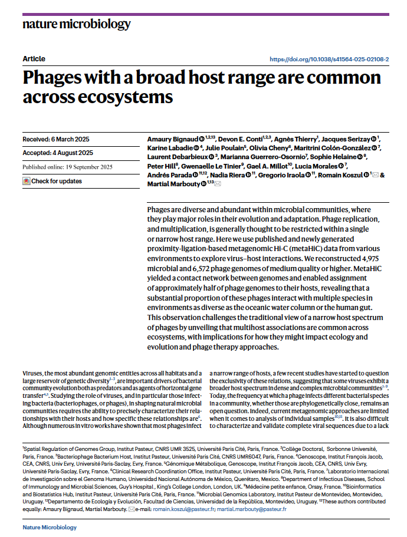
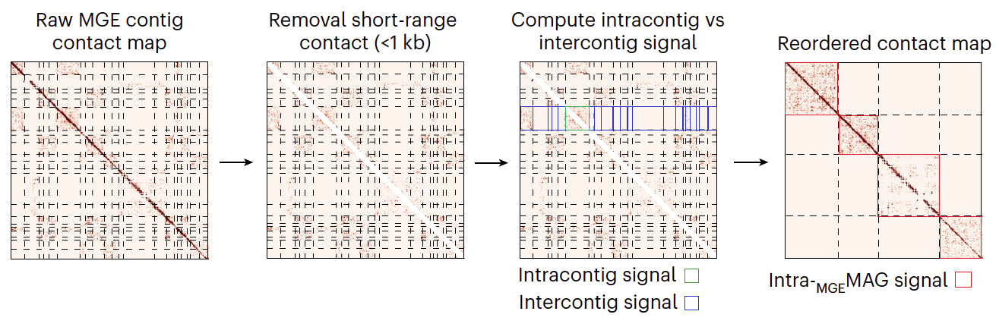
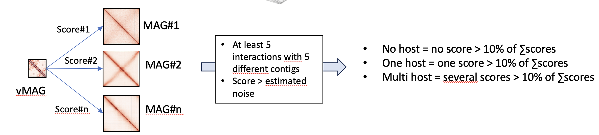

# Session 5


## Caractérisation et analyse des Elements Genetiques Mobiles (MGEs)

Nous avons développé dernièrement deux nouveaux modulex de MetaTOR permettant le binning des MGEs (metator mge) et l'attribution à leur(s) hôte(s) (metator host).
Ce module est encore en développement et ne fonctionne pas encore avec cette nouvelle version de MetaTOR.

si vous voulez jeter un oeil à cette nouvelle approche et aux derniers résultats sur le sujet, c'est par ici:

[Phages with a broad host range are common across ecosystems](https://pasteur.hal.science/pasteur-05269627v1)




### Principe du module metator mge 

Le module repose sur une propriété particulière des cartes de contact des génomes viraux et plasmidiques. En effet, les matrices de contact de ces génomes tendent à afficher des contacts relativement uniformes. Par conséquent, les contigs non ordonnés appartenant au même MGE présentent des fréquences de contact inter-contigs relativement similaires par rapport aux fréquences de contact intra-contigs (à l'exclusion, bien sûr, de la diagonale à courte portée). Ce comportement n'est pas observé pour les grands génomes bactériens, où la décroissance du contact en fonction de la distance génomique diminue progressivement avec la distance génomique. Nous avons exploité ces observations pour développer une approche informatique qui regroupe les contigs annotés comme viraux avec des fréquences de contact intra- et inter-contig comparables :

* Les paires alignées sur les contigs ciblés sont extraites et les paires situées à une distance inférieure à 1 kb sont supprimées.
* Les contacts inter-contigs sont ensuite normalisés à l'aide de la moyenne géométrique des contacts intra-contigs, générant un score Si,j = xi,j / sqrt(xi,i, xj,j) où xi,j représentent les contacts entre les contigs i et j.
* Le score le plus élevé est classé en premier, et les deux contigs classés sont traités comme un seul pour calculer un nouveau score basé sur la somme de leurs contacts avec les autres contigs.
* Les contigs sont regroupés jusqu'à ce qu'il n'y ait plus de scores supérieurs au seuil de 0,8 (seuil modifiable). 
* Les groupes résultants sont les mgeMAGs.





### Principe du module metator host

Le module repose sur une stratégie en plusieurs étapes articulée autour de la représentation des contigs dans un graphe de contacts pondéré, combinée à une modélisation statistique du bruit de fond afin d'assurer la spécificité des associations détectées.
*	Deux types d’objets sont définis : les MAGs (bins bactériens) et les mgeMAGs. Chaque objet regroupe un ensemble de contigs issus de l’assemblage shotgun, selon les clusters générés par MetaTOR ou fournis par un autre outil.
*	À partir des lectures Hi-C mappées sur les contigs, le module construit un graphe pondéré où les nœuds représentent les contigs et les arêtes traduisent des contacts physiques, pondérés par leur fréquence. Ce graphe constitue la base des analyses suivantes.
*	Afin de discriminer les vraies interactions biologiques des artefacts techniques, le module estime une distribution du bruit inter-MAG, c’est-à-dire des interactions entre ses contigs et ceux d’autres MAGs. La moyenne des interactions inter-MAG constitue donc le bruit de fond de l’expérience. Ce bruit ainsi calculé, est utilisé pour filtrer les contacts non significatifs.
*	Pour chaque mgeMAG, le module identifie les MAGs présentant un signal Hi-C enrichi par rapport au bruit. Ainsi, une association est validée si :
  	le nombre de  contigs en  contacts entre la MGE et un MAG est supérieur à un seuil minimal (par défaut 5);
  	la somme totale des interactions entre le MGE et un MAG est au moins égale 10% de ses interactions avec tous les MAGs avec lesquels il est en contact;
  	et la somme totale des interactions entre le MGE et un MAG est supérieure  au seuil de bruit de fond de l’expérience estimé.
*	Une matrice de contacts MGE × MAG est ensuite générée, chaque cellule représentant un score de co-localisation potentielle.
*	Annotation de l’hôte principal : Le module sélectionne, comme hôte principal le MAG présentant le score le plus élevé d’interaction significative avec un mgeMAG. Les autres interactions, si présentes, sont également listées et hiérarchisées.
*	Sorties et visualisation : En complément des résultats tabulés, le module fournit :
  	des plots de distributions comparant les contacts intra-MAG, inter-MAG et mgeMAG (log-transformés).
  	un graphe interactif d’interactions MGE–MAG.
  	un fichier d’annotation enrichi intégrant les hôtes détectés.



### résultats du pipeline

vous trouverez dans le dossier [metator_final/mge/] les différents fichiers d'output des deux modules mge et host:

```sh
ls -l metator_final/mge/
```

